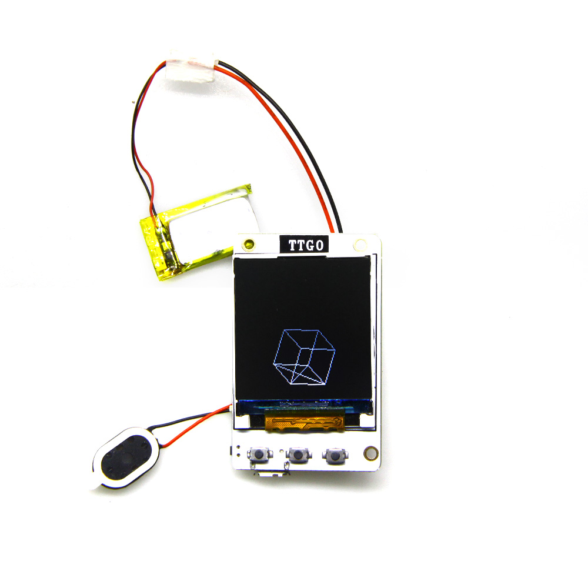

# ESP32 IMU

9-DOF IMU using ESP32 and MPU9250

## current status as of May,12,2018

just getting started, folks!

## Pins
Green LED     => 22

## Boot Process

FIXME

## Debugger Setup

1. get openocd
  * [well explained here](http://esp-idf.readthedocs.io/en/latest/api-guides/jtag-debugging/#jtag-debugging-setup-openocd)
  * [download esp32 openocd](http://esp-idf.readthedocs.io/en/latest/api-guides/jtag-debugging/setup-openocd-linux.html)

2. FTDI Connection as shown below

  | FT2232HL     |  ESP32     | Purpose    |
  | ------------ | ---------- | ---------- |
  |ADBUS0        | 13         | TCK        |
  |ADBUS1        | 12         | TDI        |
  |ADBUS2        | 15         | TDO        |
  |ADBUS3        | 14         | TMS        |
  |GND           | GND        | GND        |
  |VIO           | 3V3        | 3V3        |

  Problem is pin 12/13/14/15 are used for SDIO, which means
  * you can't use JTAG interface while using Micro-SD slot
  * we need a some special SDIO adapter to connect FT2232H and ESP32

  And finally found a wonderful sdio adapter card.
  
  Check it out at [Aliexpress](https://www.aliexpress.com/item/kebidu-Hot-sale-25CM-48CM-62CM-TF-to-micro-SD-card-Flex-Extension-cable-Extender-Adapter/32832944156.html?spm=2114.10010108.1000013.1.27bc4b3b74DRpO&scm=1007.13339.90158.0&scm_id=1007.13339.90158.0&scm-url=1007.13339.90158.0&pvid=2645295a-4392-4172-896b-e88ce2aafd8f&_t=pvid:2645295a-4392-4172-896b-e88ce2aafd8f,scm-url:1007.13339.90158.0)

  I will defer this debugging setup till the adapter arrives!
