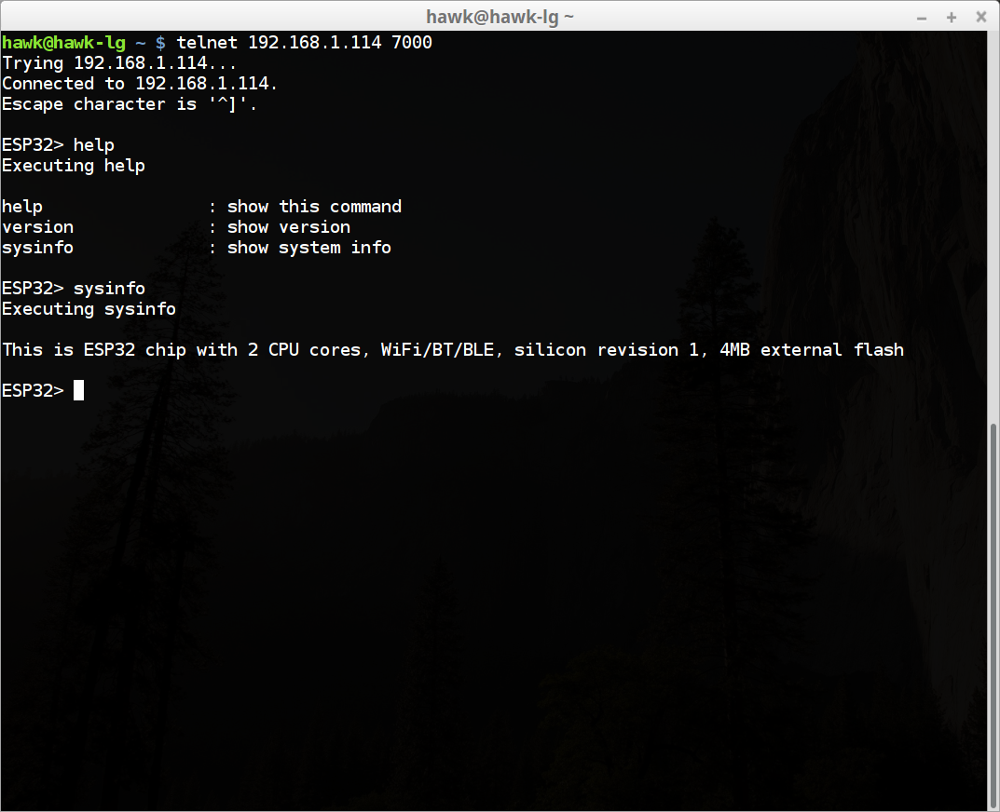
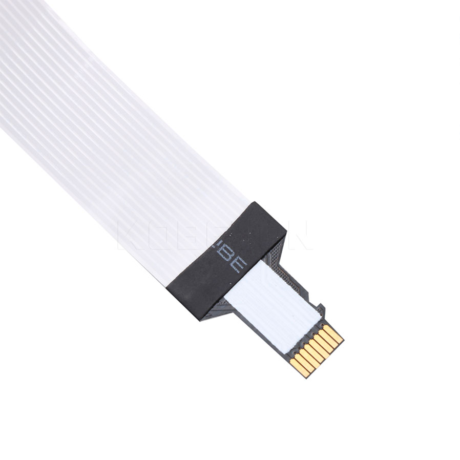

# ESP32 IMU

9-DOF IMU using ESP32 and MPU9250

## current status

### as of May,13,2018
CLI is implemented. Now you can access ESP32 via telnet.

By the way, the code might seem a bit intimidating at first.
But that is how I think networking code should be written. Everything should be an event
using an simple event loop. Otherwise you wouldn't be able to handle the complications and the concurrency in the end. Just my opinion!

### as of May,12,2018
just getting started, folks!

## Pins

| Purpose    | Pin #  |
| ---------- | ------ |
| Green LED  | 22     |

## Schematic

Check [this](doc/T10_V1.2.pdf) out

## Boot Process

To develop a firm understanding on what's going on behind the scenes, I always care about system startup process.
Actually this is well explained [here](https://esp-idf.readthedocs.io/en/v2.0/general-notes.html)

To sum it up,
1. ROM bootloader loads second-stage bootloader in SPI Flash to RAM from flash offset 0x1000
   * Second-stage bootloader source is available at components/bootloader directory of ESP-IDF.
   * Partition table is at 0x8000 of SPI flash.
   * It is interesting to note that second-stage bootloader initializes MMU!
   * Also it is interesting to note that SPI flash memory is memory mapped by MMU and can be read via normal memory read.

2. Second-stage bootloader loads partition table and main application image

3. main app executes

Application Memory Layout. The chip itself is not that simple.
ESP32 comes with 520 KiB SRAM. Most boards I know have 4 MB SPI flash.

| Type        | Note                                                                 |
| ----------- | -------------------------------------------------------------------- |
| IRAM        | instruction RAM. a part of internal SRAM0. fast execution & for ISRs |
| IROM        | instruction ROM. SPI flash.                                          |
| RTC fasl    | for code that has to run after wake-up from deep sleep.              |
| DRAM        | data ram. of course.                                                 |
| DROM        | read only data in SPI flash.                                         |
| RTC slow    | blah blah blah                                                       |

## Debugger Setup

1. get openocd
  * [well explained here](http://esp-idf.readthedocs.io/en/latest/api-guides/jtag-debugging/#jtag-debugging-setup-openocd)
  * [download esp32 openocd](http://esp-idf.readthedocs.io/en/latest/api-guides/jtag-debugging/setup-openocd-linux.html)

2. FTDI Connection as shown below

  | FT2232HL     |  ESP32     | Purpose    |
  | ------------ | ---------- | ---------- |
  |ADBUS0        | 13         | TCK        |
  |ADBUS1        | 12         | TDI        |
  |ADBUS2        | 15         | TDO        |
  |ADBUS3        | 14         | TMS        |
  |GND           | GND        | GND        |
  |VIO           | 3V3        | 3V3        |

  Problem is pin 12/13/14/15 are used for SDIO, which means
  * you can't use JTAG interface while using Micro-SD slot
  * we need a some special SDIO adapter to connect FT2232H and ESP32

  And finally found a wonderful sdio adapter.
  
  Check it out at [Aliexpress](https://www.aliexpress.com/item/kebidu-Hot-sale-25CM-48CM-62CM-TF-to-micro-SD-card-Flex-Extension-cable-Extender-Adapter/32832944156.html?spm=2114.10010108.1000013.1.27bc4b3b74DRpO&scm=1007.13339.90158.0&scm_id=1007.13339.90158.0&scm-url=1007.13339.90158.0&pvid=2645295a-4392-4172-896b-e88ce2aafd8f&_t=pvid:2645295a-4392-4172-896b-e88ce2aafd8f,scm-url:1007.13339.90158.0)

  I will defer this debugging setup till the adapter arrives!
